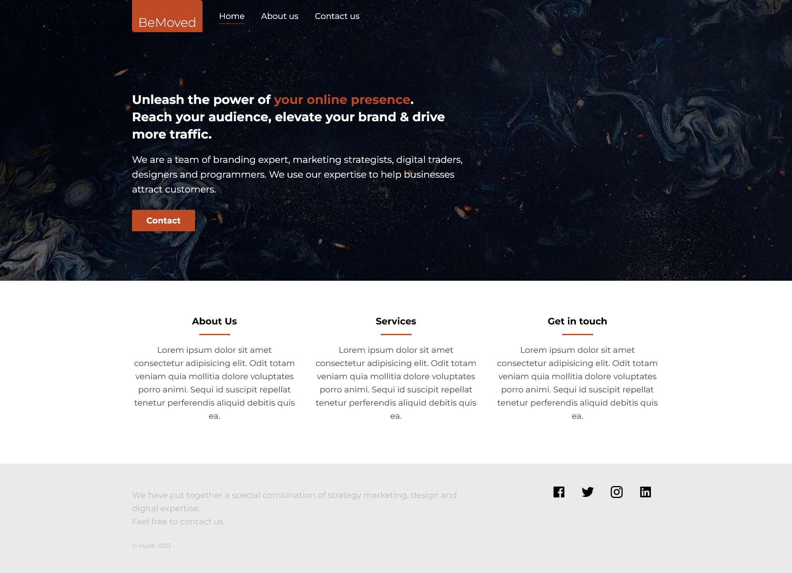

# BeMoved
Fully responsive website for a digital marketing agency using HTML and CSS and JS

## Table of contents
- [Screenshots](#screenshots)
- [Links](#links)
- [Built with](#built-with)
- [Files and directories](#files-and-directories)
- [Installation](#installation)
- [Author](#author)

## Screenshots

## Links

- Solution URL: [https://github.com/fatima-xs/bemoved-website](https://github.com/fatima-xs/bemoved-website)
- Live Site URL: [https://bemoved-fatima.netlify.app/](https://bemoved-fatima.netlify.app/)

## Built with

- HTML
- CSS 
- Vanilla JS

## Files and directories
- index.html : the homepage
- about-us.html : the about us page
- contact.html : the contact page
- index.css : the css page
- index.js : the js page
- images : the directory containing the images

## Installation
- Clone this repository to your desktop
- Navigate to the top level of the directory
- Open ./index.html in your browser

## Author
**Fatimata Ndiaye**
- [Profile](https://github.com/fatima-xs "Fatima Ndiaye") 
- [Email](mailto:fatimanndiaye@gmail.com?subject=Hi "Hi!")

